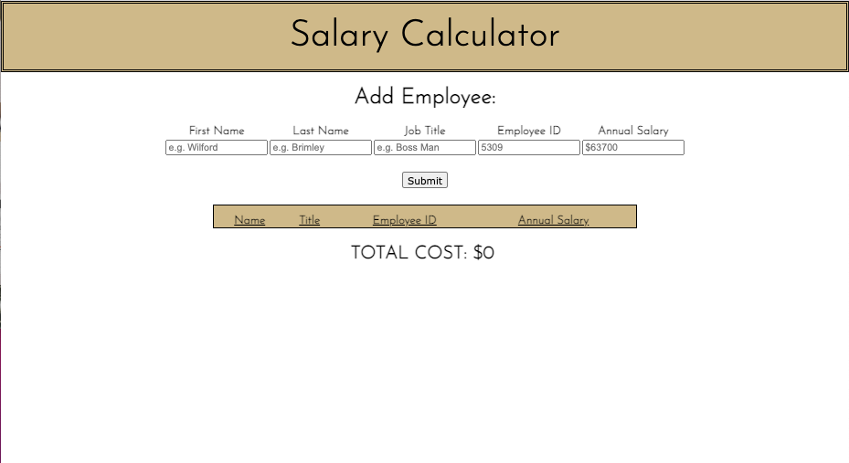
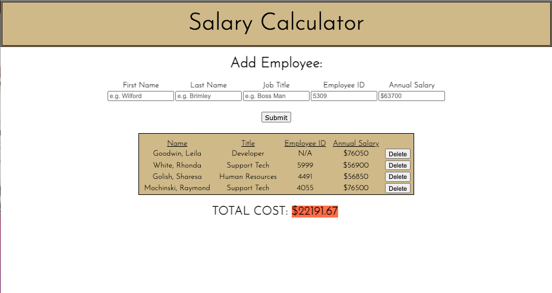

 # Salary Calculator

## Application uses employee information to calculate total montly labor costs

---

##### *Duration: Three-Day Sprint*

In this app, a user inputs information about a specific employee and uses the app to calculate their organization's monthly labor cost total.

---

---

---

### Prerequisites
---
- Internet browser application
- Internet connection

## Installation
---
No particular installation steps are required.

## Usage
---

1. Open page by URL
2. Enter employee first name (required)
3. Enter employee last name (required)
4. Enter employee job title (required)
5. Enter employee ID (not required - will show N/A if no ID)
6. Enter employee annual salary (required)
7. Press "Submit" button. Notice the "TOTAL COST" is monthly and automatically calculated
8. If needed, press the "Delete" button to remove a row
