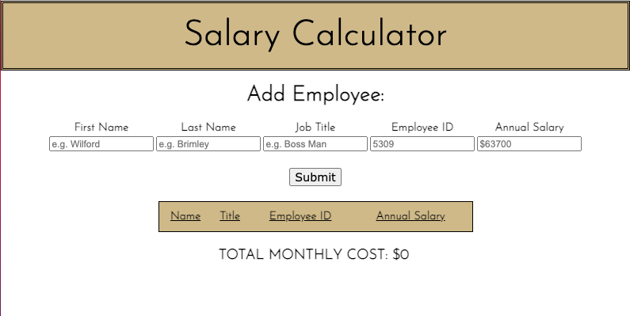
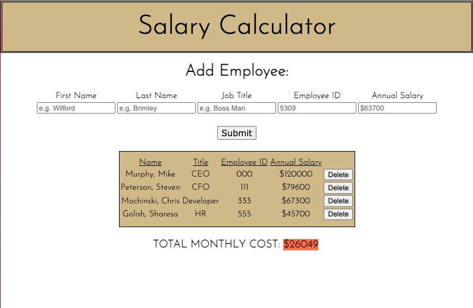

 # Salary Calculator

## Application uses employee information to calculate total ***monthly*** labor costs

---

##### _Duration: Two-Day Sprint_

In this app, a user inputs information about a specific employee and uses the app to calculate their organization's monthly labor cost total.

---

---

---

### Prerequisites
---
- Internet browser application (e.g. Chrome, Safari)

## Installation
---
No particular installation steps are required.

## Usage
---

1. Enter employee first name (required) 
2. Enter employee last name (required)
3. Enter employee job title (required)
4. Enter employee ID (not required - will show N/A if no ID)
5. Enter employee annual salary (required)
6. Press "Submit" button (notice the "TOTAL MONTHLY COST" is automatically calculated
7. If needed, press the "Delete" button to remove a row

## Built with
---
Visual Studio Code

## License
---
None

## Acknowledgement
---
Thanks to my instructor Chris Black and [Prime Digital Academy](www.primeacademy.io) for giving me the tools to do some really rad stuff. 

[Santiago Orozco](https://fonts.google.com/?query=Santiago+Orozco) for providing typeface [Josefin Sans](https://fonts.google.com/specimen/Josefin+Sans) via [Google Fonts](fonts.google.com).

Honorable mention of my cohort mates - especially [Greg Tambornino](https://github.com/gtambo) and [Andy Ehrhardt](https://github.com/AndrewEhrhardt) - for taking the time to lend a second and third pair of eyes to this application.

## Support
---
If you have questions or issues, please do not hesitate to email me at: [cmochinski@gmail.com](mailto:cmochinski@gmail.com). I'd love to hear from you!

[My Twitter (@HolyMosesMusic)](https://twitter.com/holymosesmusic)

